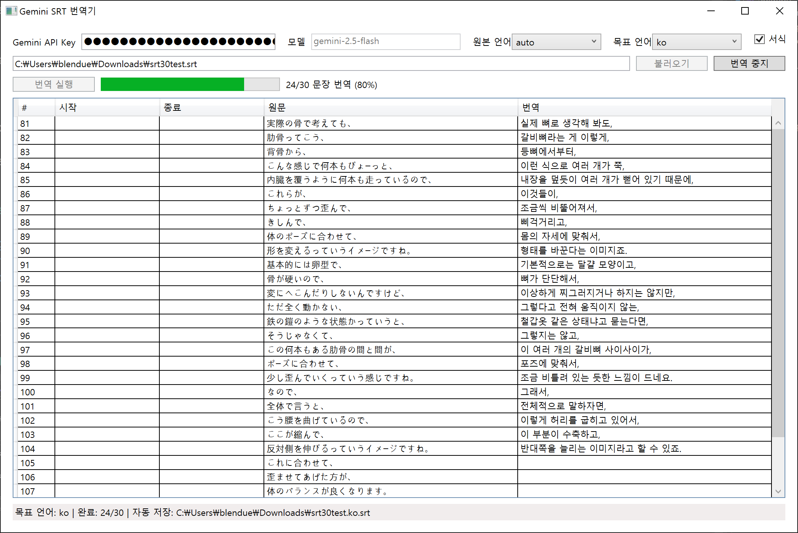

# Gemini SRT Translator

WPF 기반의 SRT 자막 번역 도구입니다. Google Gemini API의 `generateContent`를 지원하는 모델(기본값: `gemini-1.5-flash`)을 이용해 자막 문장을 지정한 언어로 일괄 번역하고, 번역본을 새 SRT 파일로 저장할 수 있습니다.

## 주요 기능
- SRT 파일 불러오기 및 자막 항목 미리보기
- 원본/목표 언어 선택과 서식(줄바꿈, HTML 태그 등) 유지 옵션 제공
- 저장된 API 키로 앱 실행 시 사용 가능한 Gemini 모델 목록을 자동으로 불러오고 드롭다운에서 선택
- Gemini API를 이용한 배치 번역 진행 상황 표시
- 번역 결과를 편집 후 새 SRT 파일로 저장

## 준비 사항
- Windows 10 이상 환경 (WPF 실행 필요)
- .NET 8.0 SDK 및 Windows Desktop 개발 워크로드
- Google AI Studio에서 발급한 Gemini API 키 [링크](https://aistudio.google.com/app/api-keys)

## 실행 방법
1. 리포지토리를 클론한 후 Visual Studio 2022(또는 `dotnet` CLI)에서 `GeminiSrtTranslator.sln`을 엽니다.
2. `GeminiSrtTranslator.App` 프로젝트를 시작 프로젝트로 설정하고 실행합니다.
3. 앱 실행 후:
   - Gemini API 키를 입력하면 사용 가능한 모델 목록이 자동으로 로드됩니다.
   - 원본 SRT 파일을 불러옵니다.
   - 목표 언어를 선택한 뒤 `번역 실행` 버튼을 눌러 결과를 확인합니다.
   - 필요 시 번역 문장을 수정하고 `번역 저장` 버튼으로 새 SRT 파일을 생성합니다.

## 환경 변수(선택)
- 입력한 Gemini API 키와 선택한 모델은 `%LOCALAPPDATA%\GeminiSrtTranslator\settings.json`에 저장되어 다음 실행 시 자동으로 채워집니다.

## 참고
- 지원되는 모델 목록은 Google Generative Language API의 `ListModels` 응답에서 확인됩니다. 실제 사용 시 과금 정책과 쿼터 제한을 확인하세요.
- 대용량 자막은 내부적으로 여러 번의 API 호출(배치 전송)로 처리됩니다.
- 번역 정확도는 모델과 프롬프트에 따라 달라질 수 있으므로 결과를 검수하는 것이 좋습니다.
